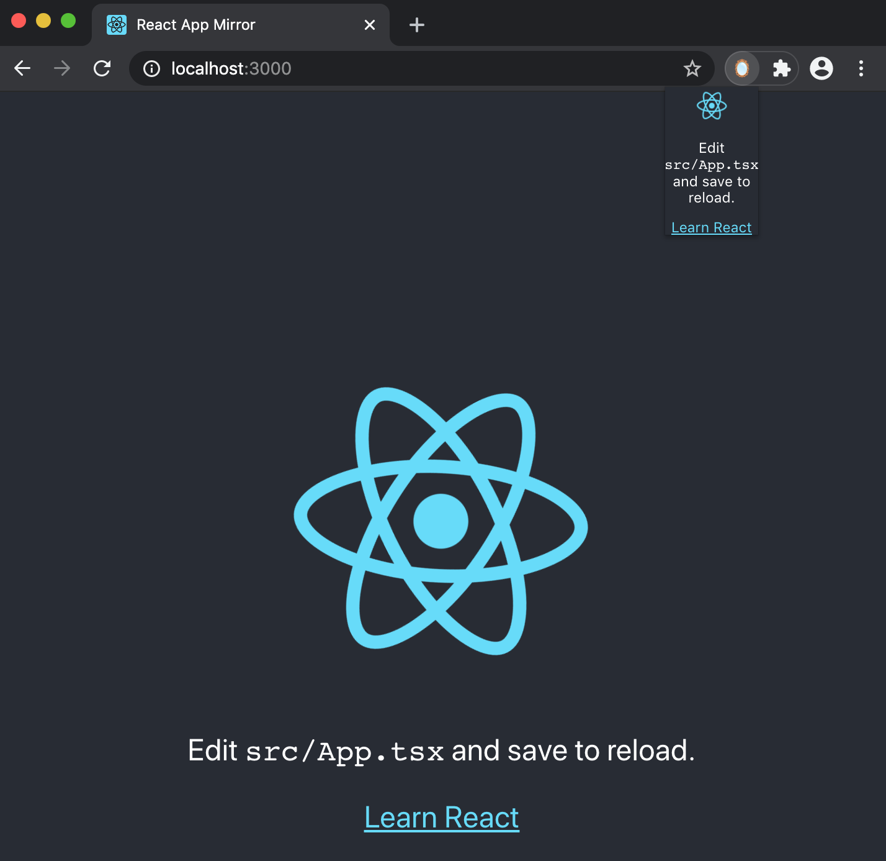

# React Mirror 

### Create a React App and mirror it in a Chrome Extension.

This is a lightweight React App using Typescript, Webpack, and SASS that was bootstrapped with [Create React App](https://github.com/facebook/create-react-app). It can be built into a Chrome Extension and developed upon in tangent. 

Be sure node is installed.

### Available Scripts

In the project directory, run:

#### `npm i`

#### `npm start`

This runs the app in the development mode.
Open [http://localhost:3000](http://localhost:3000) to view it in the browser.
The page will reload if you make edits.

#### `npm run build`

Builds the app as a usable Chrome Extension to the **build** folder.
Navigate to **chrome://extensions** in Chrome, then click **Load unpacked** and select the base **build** folder. 
After loading the extension, it can be debugged in the same way as the web app.

### et cetera

Noteworthy to checkout the manifest.json and background scripts. Sample background.ts and contentscript.ts is provided.
